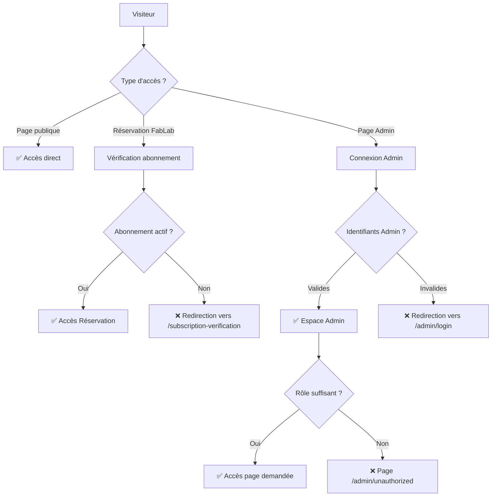

# 🔐 ARCHITECTURE D'AUTHENTIFICATION & PRÉPARATION BACKEND

**Date :** 2 juillet 2025  
**Projet :** CREC Education Platform

---

## 📋 **RÈGLES D'ACCÈS DU SITE**

### ✅ **Pages Publiques (Accessible à tous - Sans compte)**
```
🌐 PAGES PRINCIPALES
├── HomePage (/home)
├── AboutPage (/about)
├── JesuitesPage (/about/jesuites)
├── EquipePage (/about/equipe)
├── ContactPage (/contact)
├── GalleryPage (/gallery)
├── BibliothequeEnLignePage (/library)
├── DonatePage (/donate)
├── LegalPage (/legal)
├── PrivacyPage (/privacy)

🎓 FORMATIONS (CONSULTATION)
├── FormationsHubPage (/formations)
├── UniversityPage (/formations/university)
├── OpenFormationsPage (/formations/ouvertes)
├── FablabPage (/formations/fablab)

📅 ÉVÉNEMENTS (CONSULTATION)
├── EventsPage (/events)
├── EventDetailPage (/events/:id)
├── CalendarPage (/calendar)

📝 INSCRIPTIONS (FORMULAIRES PUBLICS)
├── InscriptionUniversitairePage (/formations/university/inscription)
├── OpenFormationsInscriptionPage (/formations/ouvertes/inscription)
├── FablabInscriptionPage (/formations/fablab/inscription)
```

### 🔐 **Pages Nécessitant un Abonnement FabLab Payé**
```
💳 RÉSERVATION FABLAB (Abonnés uniquement)
├── ReservationPage (/reservation) ← Accès avec abonnement vérifié
├── SubscriptionPage (/subscription) ← Gestion abonnement
├── SubscriptionVerification (/subscription-verification) ← Vérification
```

### 👨‍💼 **Pages Admin (Admin uniquement)**
```
🏛️ ESPACE ADMINISTRATION (/admin/*)
├── AdminLoginPage (/admin/login) ← PUBLIC (form connexion)
├── AdminDashboardPage (/admin/dashboard) ← ADMIN
├── UnauthorizedPage (/admin/unauthorized) ← Page d'erreur

📊 GESTION CONTENUS
├── AdminContenusISTMPage (/admin/contenus/istm)
├── AdminContenusFormationsPage (/admin/contenus/formations)
├── AdminContenusFablabPage (/admin/contenus/fablab)
├── AdminAboutPage (/admin/a-propos)
├── AdminGaleriePage (/admin/galerie)
├── AdminBibliotequePage (/admin/bibliotheque)

📋 GESTION INSCRIPTIONS
├── AdminInscriptionsISTMPage (/admin/inscriptions/istm)
├── AdminInscriptionsFormationsPage (/admin/inscriptions/formations)
├── AdminInscriptionsFablabPage (/admin/inscriptions/fablab)

🏗️ GESTION RÉSERVATIONS
├── AdminReservationsFablabPage (/admin/reservations/fablab)
├── AdminReservationsStatsPage (/admin/reservations/stats)
├── AdminMachinesPrixPage (/admin/reservations/machines-prix)

⚙️ PARAMÈTRES SYSTÈME
├── AdminParametresPage (/admin/parametres)
├── AdminUtilisateursRolesPage (/admin/parametres/utilisateurs)
├── AdminPrixDatesPage (/admin/parametres/prix-dates)
├── AdminProfilePage (/admin/profile)
```

---

## 🔒 **SYSTÈME D'AUTHENTIFICATION**

### **1. Types d'Utilisateurs**

```typescript
// Types d'utilisateurs
type UserType = 'public' | 'subscriber' | 'admin';

// Rôles Admin
type AdminRole = 'super_admin' | 'content_admin' | 'inscription_admin';

// Statut d'abonnement FabLab
type SubscriptionStatus = 'active' | 'expired' | 'pending' | 'cancelled';
```

### **2. Flux d'Authentification**



### **3. Vérifications par Type de Page**

#### **Pages Publiques** ✅
- **Aucune vérification**
- Accès libre à tous

#### **Réservation FabLab** 🔐
```typescript
// Vérification dans ProtectedRoute.tsx
const subscriberInfo = localStorage.getItem('subscriberInfo');
const isVerified = subscriberInfo ? JSON.parse(subscriberInfo).verified : false;

if (!isVerified) {
  return <Navigate to="/subscription-verification" />;
}
```

#### **Pages Admin** 👨‍💼
```typescript
// Vérification dans ProtectedRoute.tsx avec adminRequired={true}
if (!isAuthenticated) {
  return <Navigate to="/admin/login" />;
}

if (!hasRole(requiredRoles)) {
  return <Navigate to="/admin/unauthorized" />;
}

if (!canAccessRoute(location.pathname)) {
  return <Navigate to="/admin/unauthorized" />;
}
```

---

## 📊 **DONNÉES FRONTEND À PRÉPARER**

### **1. Structure des Pages Admin**

```typescript
// Chaque page admin suit cette structure
interface AdminPageData<T> {
  items: T[];
  totalCount: number;
  loading: boolean;
  error: string | null;
  selectedItem: T | null;
  isEditing: boolean;
  searchTerm: string;
  currentPage: number;
  itemsPerPage: number;
}

// Exemple pour AdminContenusISTMPage
interface UniversityProgram {
  id: string;
  title: string;
  description: string;
  image: string;
  competences: string[];
  debouches: string[];
  profil: string;
  type: 'licence' | 'master' | 'doctorat';
  duree: string;
  inscrits: number;
  capacite: number;
  fraisInscription: number;
  statut: 'active' | 'inactive' | 'draft';
  createdAt: string;
  updatedAt: string;
}
```

### **2. Hooks API Utilisés**

```typescript
// hooks/useApi.ts - Hooks déjà prêts
export const useApi = () => {
  const get = async (endpoint: string) => { /* ... */ };
  const post = async (endpoint: string, data: any) => { /* ... */ };
  const put = async (endpoint: string, data: any) => { /* ... */ };
  const delete = async (endpoint: string) => { /* ... */ };
};

// Hooks spécialisés pour chaque entité
export const usePrograms = () => useQuery(['programs'], () => api.get('/programs'));
export const useCreateProgram = () => useMutation(data => api.post('/programs', data));
export const useUpdateProgram = () => useMutation(data => api.put(`/programs/${data.id}`, data));
export const useDeleteProgram = () => useMutation(id => api.delete(`/programs/${id}`));
```

### **3. Services Frontend**

```typescript
// services/apiServices.ts - Services prêts
export const AuthService = {
  login: async (email: string, password: string) => { /* ... */ },
  logout: () => { /* ... */ },
  getCurrentUser: () => { /* ... */ },
  isAuthenticated: () => { /* ... */ }
};

export const UniversityService = {
  getAll: () => api.get('/programs'),
  create: (data: any) => api.post('/programs', data),
  update: (id: string, data: any) => api.put(`/programs/${id}`, data),
  delete: (id: string) => api.delete(`/programs/${id}`)
};

export const FabLabService = {
  getSubscriptions: () => api.get('/fablab/subscriptions'),
  createSubscription: (data: any) => api.post('/fablab/subscriptions', data),
  getReservations: () => api.get('/fablab/reservations'),
  createReservation: (data: any) => api.post('/fablab/reservations', data)
};
```

---

## 🎯 **ENDPOINTS BACKEND NÉCESSAIRES**

### **Authentication & Users**
```
POST   /api/auth/login
POST   /api/auth/logout
GET    /api/auth/me
POST   /api/auth/refresh-token

GET    /api/users/profile
PUT    /api/users/profile
POST   /api/users/change-password
```

### **Admin Dashboard**
```
GET    /api/admin/dashboard/stats
GET    /api/admin/dashboard/activities
GET    /api/admin/dashboard/recent-actions
```

### **University Programs**
```
GET    /api/programs
POST   /api/programs
GET    /api/programs/:id
PUT    /api/programs/:id
DELETE /api/programs/:id

GET    /api/rentree-scolaire
POST   /api/rentree-scolaire
PUT    /api/rentree-scolaire/:id
DELETE /api/rentree-scolaire/:id
```

### **FabLab Management**
```
// Équipements
GET    /api/fablab/equipements
POST   /api/fablab/equipements
PUT    /api/fablab/equipements/:id
DELETE /api/fablab/equipements/:id

// Projets
GET    /api/fablab/projets
POST   /api/fablab/projets
PUT    /api/fablab/projets/:id
DELETE /api/fablab/projets/:id

// Services
GET    /api/fablab/services
POST   /api/fablab/services
PUT    /api/fablab/services/:id
DELETE /api/fablab/services/:id

// Tarifs
GET    /api/fablab/tarifs
POST   /api/fablab/tarifs
PUT    /api/fablab/tarifs/:id
DELETE /api/fablab/tarifs/:id

// Abonnements
GET    /api/fablab/subscriptions
POST   /api/fablab/subscriptions
PUT    /api/fablab/subscriptions/:id
DELETE /api/fablab/subscriptions/:id

// Réservations
GET    /api/fablab/reservations
POST   /api/fablab/reservations
PUT    /api/fablab/reservations/:id
DELETE /api/fablab/reservations/:id
```

### **Inscriptions Management**
```
// Inscriptions Universitaires
GET    /api/inscriptions/istm
POST   /api/inscriptions/istm
PUT    /api/inscriptions/istm/:id/status
DELETE /api/inscriptions/istm/:id

// Inscriptions Formations Ouvertes
GET    /api/inscriptions/formations
POST   /api/inscriptions/formations
PUT    /api/inscriptions/formations/:id/status
DELETE /api/inscriptions/formations/:id

// Inscriptions FabLab
GET    /api/inscriptions/fablab
POST   /api/inscriptions/fablab
PUT    /api/inscriptions/fablab/:id/status
DELETE /api/inscriptions/fablab/:id
```

### **Content Management**
```
// Page À propos
GET    /api/content/about
PUT    /api/content/about

// Galerie
GET    /api/gallery
POST   /api/gallery
DELETE /api/gallery/:id

// Bibliothèque
GET    /api/library
POST   /api/library
PUT    /api/library/:id
DELETE /api/library/:id

// Événements
GET    /api/events
POST   /api/events
GET    /api/events/:id
PUT    /api/events/:id
DELETE /api/events/:id
```

### **File Upload**
```
POST   /api/upload/image
POST   /api/upload/video
POST   /api/upload/document
POST   /api/upload/profile-picture
```

### **Admin Management**
```
GET    /api/admin/users
POST   /api/admin/users
PUT    /api/admin/users/:id
DELETE /api/admin/users/:id
PUT    /api/admin/users/:id/roles

GET    /api/admin/settings
PUT    /api/admin/settings
```

---

## 🔧 **PROCHAINES ÉTAPES**

### **Phase 1 : Backend Authentification** (Priorité 1)
1. Créer les modèles User, Role, Permission
2. Implémenter JWT authentication
3. Créer les middlewares de protection
4. Tester l'authentification admin

### **Phase 2 : CRUD de Base** (Priorité 2)
1. Modèles et endpoints pour programmes universitaires
2. Modèles et endpoints pour FabLab
3. Gestion des inscriptions de base
4. Upload de fichiers

### **Phase 3 : Fonctionnalités Avancées** (Priorité 3)
1. Dashboard avec analytics
2. Notifications en temps réel
3. Système de backup
4. Optimisations performance

---

**✅ Status : FRONTEND PRÊT POUR INTÉGRATION BACKEND**  
**🎯 Prochaine étape : Création des modèles Prisma et endpoints FastAPI**
