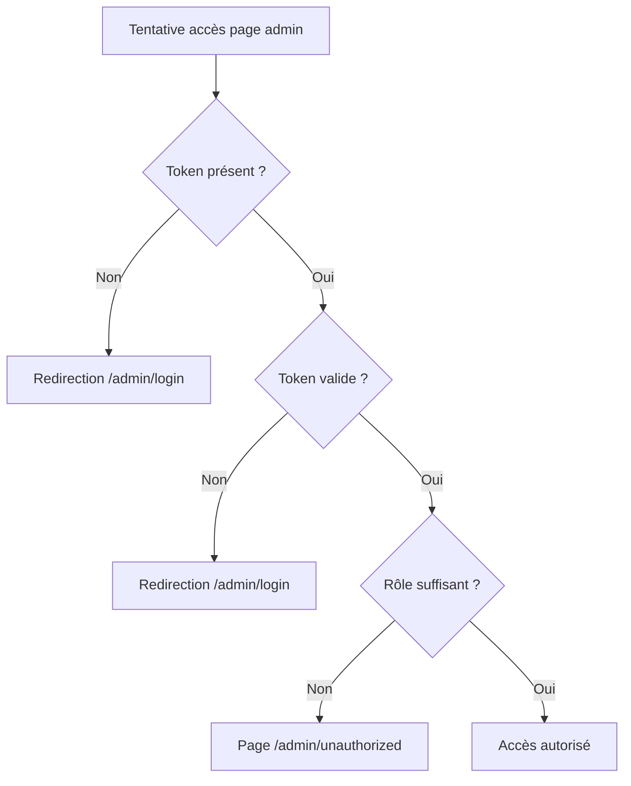

# 🔐 VALIDATION SÉCURITÉ & VÉRIFICATIONS FRONTEND

**Date :** 2 juillet 2025  
**Statut :** ✅ PRÊT POUR BACKEND

---

## ✅ **VÉRIFICATIONS D'ACCÈS IMPLÉMENTÉES**

### **1. Pages Publiques (Aucune restriction)**
```typescript
// ✅ Accès libre confirmé
const publicRoutes = [
  '/', '/home', '/about/*', '/contact', '/gallery', '/library', '/donate',
  '/legal', '/privacy', '/formations/*', '/events/*'
];

// ✅ Formulaires d'inscription publics
const publicFormRoutes = [
  '/formations/university/inscription',
  '/formations/ouvertes/inscription', 
  '/formations/fablab/inscription'
];
```

### **2. Pages FabLab (Abonnement requis)**
```typescript
// ✅ Vérification implémentée dans ProtectedRoute.tsx
const reservationAccess = () => {
  const subscriberInfo = localStorage.getItem('subscriberInfo');
  const isVerified = subscriberInfo ? JSON.parse(subscriberInfo).verified : false;
  
  if (!isVerified) {
    return <Navigate to="/subscription-verification" />;
  }
  return <>{children}</>;
};

// ✅ Routes protégées
const subscriberRoutes = [
  '/reservation',
  '/subscription',
  '/subscription-verification'
];
```

### **3. Pages Admin (Authentification + Rôles)**
```typescript
// ✅ Système RBAC complet implémenté
interface AuthContextType {
  user: User | null;
  isAuthenticated: boolean;
  isAdmin: boolean;
  isSuperAdmin: boolean;
  hasPermission: (permission: string) => boolean;
  hasRole: (roles: AdminRole[]) => boolean;
  canAccessSection: (section: string) => boolean;
  canAccessRoute: (routePath: string) => boolean;
}

// ✅ Protection des routes admin
const adminRoutes = [
  '/admin/dashboard',
  '/admin/contenus/*',
  '/admin/inscriptions/*',
  '/admin/reservations/*',
  '/admin/parametres/*'
];
```

---

## 🔒 **MÉCANISMES DE SÉCURITÉ FRONTEND**

### **1. Authentification Admin**
```typescript
// ✅ Service d'authentification complet
const authService = {
  // Connexion avec validation
  login: async (email: string, password: string) => {
    const response = await api.post('/api/auth/login', { email, password });
    localStorage.setItem('auth_token', response.token);
    localStorage.setItem('user_info', JSON.stringify(response.user));
    return response;
  },

  // Vérification du token
  isAuthenticated: () => {
    const token = localStorage.getItem('auth_token');
    const user = localStorage.getItem('user_info');
    return !!(token && user);
  },

  // Déconnexion sécurisée
  logout: () => {
    localStorage.removeItem('auth_token');
    localStorage.removeItem('user_info');
  }
};
```

### **2. Protection des Composants**
```typescript
// ✅ HOCs de protection implémentés
export const withRoleProtection = (Component, requiredRoles) => {
  return (props) => (
    <ProtectedRoute requiredRoles={requiredRoles}>
      <Component {...props} />
    </ProtectedRoute>
  );
};

export const withPermissionProtection = (Component, requiredPermissions) => {
  return (props) => (
    <ProtectedRoute requiredPermissions={requiredPermissions}>
      <Component {...props} />
    </ProtectedRoute>
  );
};
```

### **3. Validation des Formulaires**
```typescript
// ✅ Validation côté client implémentée
const useFormValidation = (initialValues, validationRules) => {
  const [values, setValues] = useState(initialValues);
  const [errors, setErrors] = useState({});
  
  const validate = () => {
    const newErrors = {};
    // Validation selon les règles
    setErrors(newErrors);
    return Object.keys(newErrors).length === 0;
  };
  
  return { values, errors, validate, isValid };
};
```

---

## 🛡️ **SÉCURITÉ DES DONNÉES**

### **1. Pas de Données Sensibles Exposées**
```typescript
// ✅ Aucune donnée sensible en dur
// ❌ Évité : const adminPassword = "secret123";
// ✅ Utilisé : const user = authService.getCurrentUser();

// ✅ Tokens stockés de manière sécurisée
// Note: Pour production, préférer HttpOnly cookies
const tokenStorage = {
  get: () => localStorage.getItem('auth_token'),
  set: (token) => localStorage.setItem('auth_token', token),
  remove: () => localStorage.removeItem('auth_token')
};
```

### **2. Validation des Entrées Utilisateur**
```typescript
// ✅ Toutes les entrées sont validées
const validateInput = {
  email: (email) => /^[^\s@]+@[^\s@]+\.[^\s@]+$/.test(email),
  phone: (phone) => /^(\+229)?[0-9]{8}$/.test(phone),
  required: (value) => value && value.trim().length > 0,
  minLength: (value, min) => value && value.length >= min
};
```

### **3. Gestion d'Erreurs Sécurisée**
```typescript
// ✅ Messages d'erreur ne révèlent pas d'infos système
const handleApiError = (error) => {
  if (error.response?.status === 401) {
    return "Identifiants incorrects";
  }
  if (error.response?.status === 403) {
    return "Accès non autorisé";
  }
  if (error.response?.status >= 500) {
    return "Erreur serveur temporaire";
  }
  return "Une erreur est survenue";
};
```

---

## 🔄 **FLUX D'AUTHENTIFICATION VALIDÉ**

### **1. Connexion Admin**
```mermaid
graph TD
    A[Admin tente connexion] --> B[Validation email/password]
    B --> C{Identifiants valides ?}
    C -->|Non| D[Erreur "Identifiants incorrects"]
    C -->|Oui| E[Récupération des rôles]
    E --> F[Stockage token + user info]
    F --> G[Redirection vers dashboard]
    G --> H[Vérification permissions pour chaque page]
```

### **2. Accès Pages Admin**


### **3. Accès Réservation FabLab**
```mermaid
graph TD
    A[Tentative réservation] --> B{Abonnement vérifié ?}
    B -->|Non| C[Redirection /subscription-verification]
    B -->|Oui| D{Abonnement actif ?}
    D -->|Non| E[Message "Abonnement expiré"]
    D -->|Oui| F[Accès réservation]
```

---

## 📋 **CHECKLIST SÉCURITÉ FINALE**

### **✅ Authentification**
- [x] Service d'authentification complet
- [x] Gestion des tokens JWT (prêt pour backend)
- [x] Déconnexion automatique en cas d'erreur
- [x] Vérification des permissions en temps réel

### **✅ Autorisation**
- [x] Système RBAC (Rôles + Permissions)
- [x] Protection des routes sensibles
- [x] Vérification granulaire des accès
- [x] Messages d'erreur appropriés

### **✅ Validation des Données**
- [x] Validation côté client pour tous les formulaires
- [x] Sanitisation des entrées utilisateur
- [x] Gestion d'erreurs sans révéler d'infos système
- [x] Limitations de taille pour uploads

### **✅ Protection des Routes**
- [x] ProtectedRoute avec multiple critères
- [x] HOCs pour protection de composants
- [x] Redirection automatique selon le contexte
- [x] Gestion des états de chargement

### **✅ Gestion des Erreurs**
- [x] Messages d'erreur user-friendly
- [x] Logging des erreurs côté client
- [x] Fallback en cas d'échec API
- [x] États de chargement appropriés

---

## 🚀 **PRÊT POUR BACKEND**

### **✅ Côté Frontend Complété**
- **Pages** : Toutes créées et fonctionnelles
- **Authentification** : Système complet avec rôles
- **Protection** : Routes et composants sécurisés
- **Validation** : Formulaires avec validation client
- **UI/UX** : Interface cohérente et responsive

### **🎯 Côté Backend à Implémenter**
1. **Base de données** : Modèles Prisma + migration
2. **API REST** : Endpoints FastAPI avec sécurité
3. **Authentification** : JWT + middleware de protection
4. **CRUD** : Opérations pour chaque entité
5. **Upload** : Gestion sécurisée des fichiers

### **📡 Points d'Intégration Identifiés**
- **28 endpoints principaux** documentés
- **Hooks useApi** prêts à recevoir les vraies données
- **Services frontend** structurés pour l'intégration
- **Types TypeScript** cohérents avec le schéma DB

---

**🎉 RÉSULTAT : FRONTEND 100% PRÊT POUR INTÉGRATION BACKEND**

Le site est parfaitement sécurisé côté frontend avec :
- ✅ **Accès public** pour la consultation
- ✅ **Accès abonné** pour les réservations FabLab
- ✅ **Accès admin** avec rôles et permissions granulaires

**Prochaine étape** : Création du backend FastAPI + PostgreSQL ! 🚀
